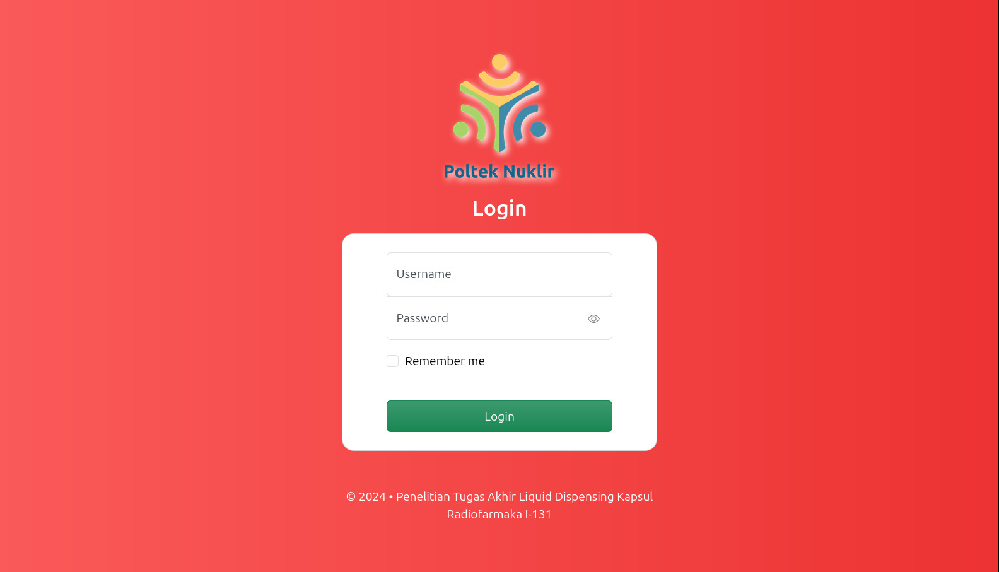
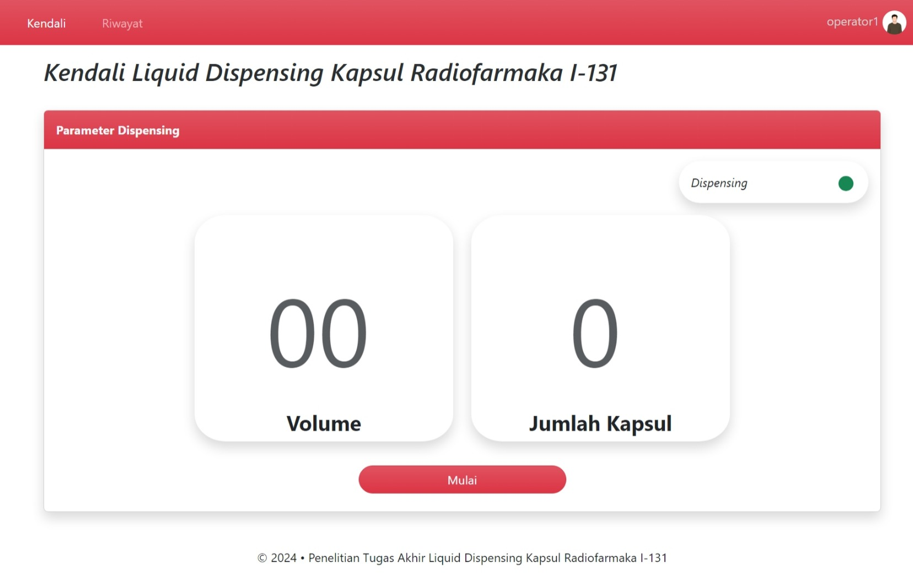
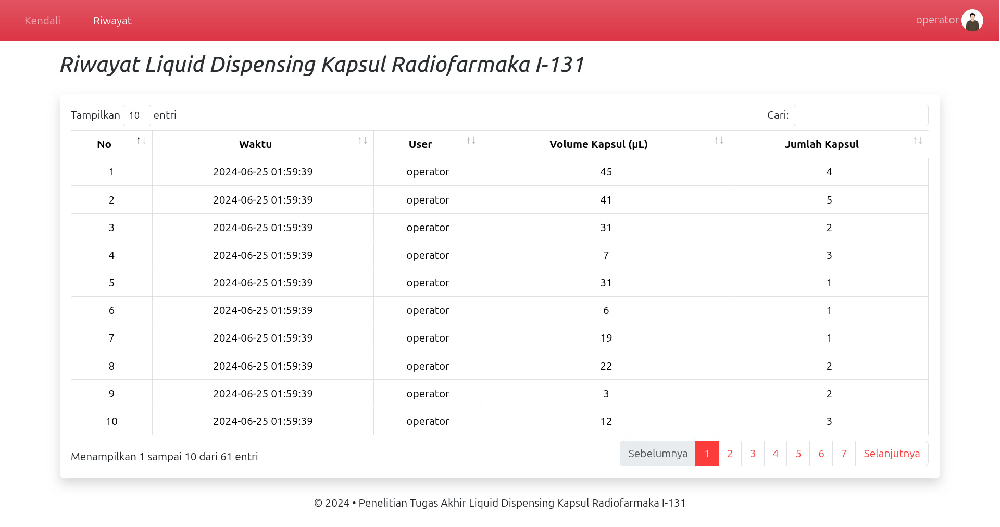

# User Interface IoT Liquid Dispensing Kapsul Radifarmaka I-131

User Interface ini dibuat sebagai tampilan kendali untuk mengendalikan proses dispensing I-131 ke dalam kapsul.

## Registrasi User

Registrasi user menggunakan API. Gunakan `register-key` pada request header ketika registrasi user. Dapatkan register key menggunakan user yang sudah terdaftar.

# Get Register Key

- Request URL (`GET`): `/api/register-key`

- Request body:
```json
    {
        "username": "username",
        "password": "password"
    }
```

- Response: 
```json
    {
        "register-key": "key"
    }
```


# Register User

- Request URL (`POST`): `/api/register`

- Request Header:
```header
register-key: "key"
```
    
- Request body: 
```json
    {
        "username": "username",
        "password": "password"
    }
```

- Response:
```json
    {
        "data": {
            "id": 1,
            "username": "username"
        }
    }
```

## Tampilan

User interface ini akan mengirimkan parameter dispensing dengan volume maksimal 50 dan jumlah kapsul maksimal 5.

**Login**


**Kendali**


**Riwayat**

